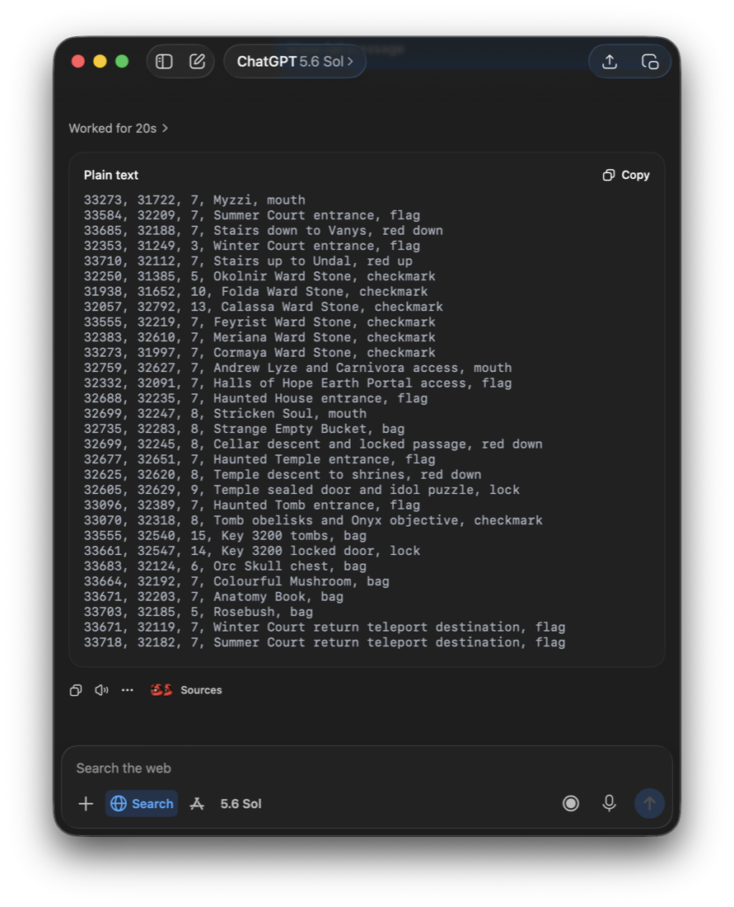

# Generating quest marks from Tibia Wiki with an AI assistant

[Tibia Maps Merge](https://nesleykent.github.io/tibia-maps-merge/) can turn a
plain-text list of Tibia coordinates into a ready-to-install
`minimapmarkers.bin`. Its **Edit Marks** mode accepts one mark per line:

```text
x, y, z, Label, icon
```

For example:

```text
33273, 31997, 7, Cormaya Ward Stone, checkmark
33584, 32209, 7, Summer Court entrance, flag
32735, 32283, 8, Strange Empty Bucket, bag
```

That opens up an interesting workflow when combined with Tibia Wiki and an AI
assistant:

```text
Tibia Wiki quest article
        ↓
coordinate extraction prompt
        ↓
x, y, z, Label, icon
        ↓
Tibia Maps Merge / Edit Marks
        ↓
minimapmarkers.bin
        ↓
Tibia
```

The idea is simple: give the assistant a Tibia Wiki quest URL and a
specialized extraction prompt. It inspects the quest guide and its location
links, extracts the coordinates used throughout the walkthrough, assigns
useful labels and marker icons, and returns text you paste straight into Add
Marks. Tibia Maps Merge handles the marker file itself.

> **Just want the coordinates?** Edit Marks can now read an article by itself
> — paste the URL into step 2 and it fills the coordinate field with every
> position the article links to, labelled from the surrounding sentence. That
> covers extraction. The workflow below is still what gets you *semantic*
> results: an icon chosen per location, and a label written for a player
> rather than lifted from the prose.

## Why this is useful

Large quests contain dozens of relevant locations. A guide may reference quest
NPCs; entrances and exits; stairs, ladders and holes; teleports; doors and
access points; levers and other interactive objects; quest items and chests;
puzzles; dangerous passages; bosses and boss rooms; shortcuts; and locations
required during individual missions.

Many of these already have exact coordinates on Tibia Wiki, but they are easy
to miss by hand. Depending on the wiki, a coordinate may sit *inside a map
link* — a sentence says to go "here" while the hyperlink on `here` carries the
position — or be written inline next to the instruction. On
tibiawiki.com.br, for instance, the walkthrough is behind a spoiler toggle and
the coordinates appear as `(33584,32209,7:2aqui)` in the middle of the prose.

Either way they are scattered across dozens of paragraphs, spoilers and
subsections. The extraction prompt collects them into a single marker list.

## The output format

Every generated mark uses:

```text
x, y, z, Label, icon
```

The first three fields are Tibia's X, Y and Z coordinates. `Label` is the
short description that shows up on the minimap. The final field is the marker
icon.

Both trailing fields are optional per line. Anything you leave out falls back
to the **Label** and **Marker icon** fields in Edit Marks, so you can also
paste bare `x, y, z` lines and label the whole batch at once.

## Use the icon names the tool actually knows

This is the one detail worth getting right. The icon name is matched against
the table the parser and encoder share, so it must be one of these twenty
(the byte on the right is what ends up in `minimapmarkers.bin`):

| Icon name   | Appearance            | Byte   |
| ----------- | --------------------- | ------ |
| `checkmark` | Green checkmark       | `0x00` |
| `?`         | Blue question mark    | `0x01` |
| `!`         | Red exclamation mark  | `0x02` |
| `star`      | Orange star           | `0x03` |
| `crossmark` | Bright red crossmark  | `0x04` |
| `cross`     | Dark red cross        | `0x05` |
| `mouth`     | Mouth                 | `0x06` |
| `spear`     | Spear                 | `0x07` |
| `sword`     | Sword                 | `0x08` |
| `flag`      | Blue flag             | `0x09` |
| `lock`      | Golden lock           | `0x0A` |
| `bag`       | Brown bag             | `0x0B` |
| `skull`     | Skull                 | `0x0C` |
| `$`         | Green dollar sign     | `0x0D` |
| `red up`    | Red arrow up          | `0x0E` |
| `red down`  | Red arrow down        | `0x0F` |
| `red right` | Red arrow right       | `0x10` |
| `red left`  | Red arrow left        | `0x11` |
| `up`        | Green arrow up        | `0x12` |
| `down`      | Green arrow down      | `0x13` |

Names are case-insensitive, so `RED DOWN` works as well as `red down`.

**An unrecognized name is not an error** — it is treated as part of the label.
A line ending in `arrowdown` or `dollar` produces a marker labelled
"… , arrowdown" carrying whatever icon is selected in the Edit Marks form, with
no warning. That is why the prompt below spells out the exact names. If a
batch comes back with labels ending in stray icon words, the assistant
invented names; correct them and paste again.

You can always see the full list in the app: click the icon swatch in Add
Marks to open the icon sheet, which shows every icon with its name and byte.

## Semantic marker icons

The prompt does more than extract coordinates — it classifies each one by its
purpose in the quest:

```text
mouth       NPC or required dialogue
sword       Boss, boss room or major battle
bag         Quest item, collectible or chest
lock        Locked door, key or access mechanism
flag        Actual entrance, exit, teleport or transport point
up/down     Ordinary floor transition
red up      Transition to a higher floor
red down    Transition to a lower floor
checkmark   Interactive quest objective
star        Puzzle, landmark or special location
!           Dangerous or critical location
spear       Regular combat location
skull       Tomb, death-related or macabre location
$           Purchase, payment or fee
```

This produces something more useful than a pile of identical pins. A `mouth`
is an NPC interaction, a `bag` is something to pick up, a `sword` is a boss,
a `red down` is a floor transition — the minimap ends up communicating part of
the quest structure visually.

The coordinate's endpoint matters more than the verb in the walkthrough. If a
sentence says to use a teleport and the map link is attached to a boss name,
that link can identify the boss encounter destination: `Sugar Daddy` is then
`Sugar Daddy, sword`, not an invented `Sugar Daddy Teleport, flag`. A separate
map link for the physical teleport tile still uses `flag`. If the boss step
provides only the access coordinate and immediately says the boss is inside,
the prompt collapses that access into the more useful named boss mark. When
separate access and encounter coordinates exist, it preserves both roles and
classifies each independently.

Ordinary floor arrows normally need no label. In the supplied default marker
collection, 3,584 of 4,219 `up`/`down` marks have an empty description; named
ones usually add a real destination or purpose such as `Dessert Dungeons` or
`To exit`. The prompt therefore emits `x, y, z, , up` or `x, y, z, , down` for
routine traversal instead of repeating what the icon already says with labels
like `Stairs Up`. A nearby NPC, item, boss or objective keeps its own named
marker rather than lending that identity to the stairs.

## Quest order is preserved

The prompt asks the assistant to keep quest progression. If a guide describes:

```text
NPC → entrance → stairs → lever → chest → teleport → boss
```

the marks should follow that sequence rather than being sorted numerically.
The list is then useful both as import data and as a compact representation of
the walkthrough.

Note that Edit Marks sorts the final file the way the Tibia client does (by
floor, then position), so the ordering matters for reading and editing the
pasted list, not for the resulting `.bin`.

## One line per coordinate

Edit Marks keys marks by their `(x, y, z)` coordinate — the same rule the merge
pipeline uses. If two lines share a coordinate, the **last one wins** and the
earlier one is silently dropped.

So when a single tile serves several purposes across the walkthrough, fold
them into one label rather than emitting the location twice:

```text
32699, 32245, 8, Cellar descent / return point, red down
```

The prompt below instructs the assistant accordingly.

## Coordinates must come from Tibia Wiki

A central requirement of the prompt is source discipline. Coordinates should
come directly from Tibia Wiki location and map URLs. The assistant is told to
inspect the links attached to words like `here`, `map`, `NPC`, `entrance`,
`exit`, `stairs`, `hole`, `ladder`, `teleport`, `portal`, `door`, `lever`,
`item`, `chest` and `boss`, and equivalent terms throughout the article.

Coordinates should not be estimated from screenshots or inferred from where
something sits on a map image. That distinction matters because the output
becomes an actual Tibia marker file.

## Why the prompt requests two passes

Quest articles are large and structurally messy. A first pass tends to find
the major NPCs, entrances and bosses while missing a small `here` link buried
in an optional access section. The prompt therefore asks for a second complete
pass over the article, checking spoilers, subsections, access instructions,
objects, transitions and boss sections again. This noticeably improves
coverage on long quests.

## Make sure the assistant can actually read the article

Two things can quietly starve the extraction, and both are worth checking
before blaming the prompt:

- **The walkthrough may be behind a spoiler toggle.** On tibiawiki.com.br the
  visible page is barely a summary — the entire guide sits in a collapsed
  spoiler block. It *is* in the page source, so an assistant that reads the
  HTML gets it, but one that only reads rendered text may see a few hundred
  words and return almost nothing.
- **The site may challenge automated fetches.** tibiawiki.com.br sits behind
  Cloudflare, which answers plain HTTP fetches with an interstitial instead of
  the article. If the assistant reports that it cannot open the URL, paste the
  article text into the conversation instead of the link and keep the rest of
  the prompt unchanged — that is exactly how the worked example below was
  produced.

A quick sanity check: if the returned list has only a handful of marks for a
long quest, the assistant probably never saw the walkthrough.

## The prompt

The app and this guide use one canonical prompt:
[**Tibia Wiki Quest Coordinate Extractor — System Prompt**](../docs/prompts/tibia-wiki-quest-coordinate-agent-system-prompt.md).
Its `{{QUEST_URL}}` placeholder is replaced automatically by **Copy Prompt**,
**Open in ChatGPT**, and every option under **Other Assistants**. To use the
file manually, replace that placeholder with the Tibia Wiki quest article URL.

## A worked example

Running the prompt above against
[The Dream Courts Quest](https://www.tibiawiki.com.br/wiki/The_Dream_Courts_Quest)
looks like this — one plain-text block, ready to copy:



A run produced these 30 marks, covering the whole quest from the first NPC
through the Ward Stones, the three Haunted Houses and the Nightmare Beast
items:

```text
33273, 31722, 7, Myzzi / court access dialogue, mouth
33584, 32209, 7, Summer Court entrance, flag
33685, 32188, 7, Stairs down to Vanys, red down
32353, 31249, 3, Winter Court entrance, flag
33710, 32112, 7, Stairs up to Undal, red up
32250, 31385, 5, Okolnir Ward Stone, checkmark
31938, 31652, 10, Folda Ward Stone, checkmark
32057, 32792, 13, Calassa Ward Stone, checkmark
33555, 32219, 7, Feyrist Ward Stone, checkmark
32383, 32610, 7, Meriana Ward Stone, checkmark
33273, 31997, 7, Cormaya Ward Stone, checkmark
32759, 32627, 7, Andrew Lyze / sealed sarcophagus entrance, mouth
32332, 32091, 7, Halls of Hope Earth Portal access, lock
32688, 32235, 7, Haunted House entrance / descent, red down
32699, 32247, 8, Stricken Soul / Haunted Nexus task, mouth
32735, 32283, 8, Strange Empty Bucket, bag
32699, 32245, 8, Cellar door / lower descent, red down
32677, 32651, 7, Haunted Temple entrance / descent, red down
32625, 32620, 8, Temple altar descent, red down
32605, 32629, 9, Sealed temple altar door, lock
33096, 32389, 7, Haunted Tomb entrance, skull
33070, 32318, 8, Tomb obelisks / Onyx puzzle, checkmark
33555, 32540, 15, Key 3200 tombs, bag
33661, 32547, 14, Key 3200 door, lock
33683, 32124, 6, Orc Skull chest, bag
33664, 32192, 7, Colourful Mushroom, bag
33671, 32203, 7, Anatomy Book, bag
33703, 32185, 5, Rosebush, bag
33671, 32119, 7, Winter Court return destination, flag
33718, 32182, 7, Summer Court return destination, flag
```

Every coordinate above was checked against the article: all 30 appear verbatim
in the page text, none were invented, every icon name resolved rather than
leaking into a label, no coordinate is repeated, and the set encodes to a
valid 1,269-byte `minimapmarkers.bin` that re-parses to the same 30 marks.

That run also happened to reach every coordinate the article contains, which
will not always be the case — the **Review** step is still where you check the
result against the source.

Paste the output straight into Edit Marks.

### Your run will not match this one exactly

These are language models, so the same prompt on the same article gives a
slightly different answer each time, and different models differ more. That is
normal, and it does not affect the part that matters most.

Two separate runs of this prompt over the same article were compared:

| | Result |
| --- | --- |
| Marks returned | 30 in both |
| Coordinate sets | **identical** |
| Coordinates supported by the article | **all of them, in both** |
| Icons chosen | 26 of 30 the same |
| Labels worded identically | 18 of 30 |

The pattern is worth knowing: **coordinates are anchored to the article, so
they come out stable. Wording is not, so it drifts.** The same location came
back as "Myzzi" in one run and "Myzzi / court access dialogue" in the other;
"Haunted House entrance" in one and "Haunted House entrance / descent" in the
other. A few icons differ too, usually where a spot could reasonably be called
an entrance or a descent.

So treat the labels and icons as a first draft to skim in **Review**, and the
coordinates as the part a model is least likely to get creative with — while
still checking them, since nothing stops one from inventing a coordinate.
Expect weaker results from models other than ChatGPT, and expect the same
model to change behaviour over time.

## Using the result

1. Open [Tibia Maps Merge](https://nesleykent.github.io/tibia-maps-merge/) and
   select **Edit Marks**.
2. *Optional* — under **Your marker file**, load your existing
   `minimapmarkers.bin` or `markers.json`. The new marks are merged into it by
   coordinate, yours winning on a clash, so the download is your whole marker
   file rather than just the quest marks. Leave it empty to start a new file.
3. Paste the generated lines into **Coordinates** under **Define marks**, then
   click **Add N Marks**. Lines that can't be parsed are reported and skipped
   rather than failing the batch, so a stray line of prose does no harm.
4. Check the list under **Review**. Each row has **Edit** and **Delete**, so a
   wrong label, coordinate or icon is fixable without regenerating anything.
5. Click **Download minimapmarkers.bin**. You get a `.zip` containing the new
   `minimapmarkers.bin`, a backup of any file you loaded, and
   `add-marks-log.txt` recording what was written.
6. Drop the new `minimapmarkers.bin` into your Tibia client's `minimap` folder,
   replacing the old one, and restart the client. (Paths are listed under
   "Where do I find my minimapmarkers.bin?" on the app page.)

The pasted list survives a page reload, so you can build it up over several
sittings before downloading.

### Combining with community markers

Loading your own file first folds the quest marks into your personal
collection. If you also want tibiamaps.io's community markers, use **Merge
Mode**: it fetches the latest community markers and merges them with a marker
file you upload, matching by coordinate with your version winning. So a full
pipeline can be:

```text
Community markers          Existing personal markers
        └────────── Merge ──────────┘
                     ↓
             Merged marker file
                     ↓
              Edit Marks (load it, paste quest marks)
                     ↓
        Quest-ready minimapmarkers.bin
```

## Model compatibility

This prompt has primarily been tested with ChatGPT, which has handled the
combination of page inspection, hyperlink extraction, semantic classification
and strict output formatting more reliably. The worked example above is a real
GPT run against the article text, unedited. Gemini has produced weaker results
with the same prompt, particularly on complete coordinate coverage and strict
adherence to the requested output.

Model behaviour changes over time, so treat the generated marks as extracted
data worth verifying against the source article — the **Review** step exists
for exactly that. See
[Your run will not match this one exactly](#your-run-will-not-match-this-one-exactly)
for how much two runs actually differed.

## Limitations

The quality of the marker set depends on what Tibia Wiki actually exposes.
Some instructions have no linked coordinate at all. Some coordinates describe
a general area rather than every action inside it. Articles change as
contributors update walkthroughs.

The prompt deliberately favours directly supported coordinates over invented
precision, which keeps the generated set traceable back to the quest guide.

Two hard limits come from the file format itself, both enforced by the app:
labels are capped at 100 bytes, and floors must be `0`–`15`. Lines that break
either rule are reported and skipped.

## Result

Tibia Wiki supplies the quest knowledge and coordinates, the assistant
extracts and classifies the locations, and Tibia Maps Merge converts them into
a ready-to-install marker file:

```text
Quest URL
   ↓
AI assistant + extraction prompt
   ↓
x, y, z, Label, icon
   ↓
Tibia Maps Merge
   ↓
minimapmarkers.bin
   ↓
Quest markers directly on the Tibia minimap
```

A practical way to turn a detailed walkthrough into navigational data that
follows you inside the game.
