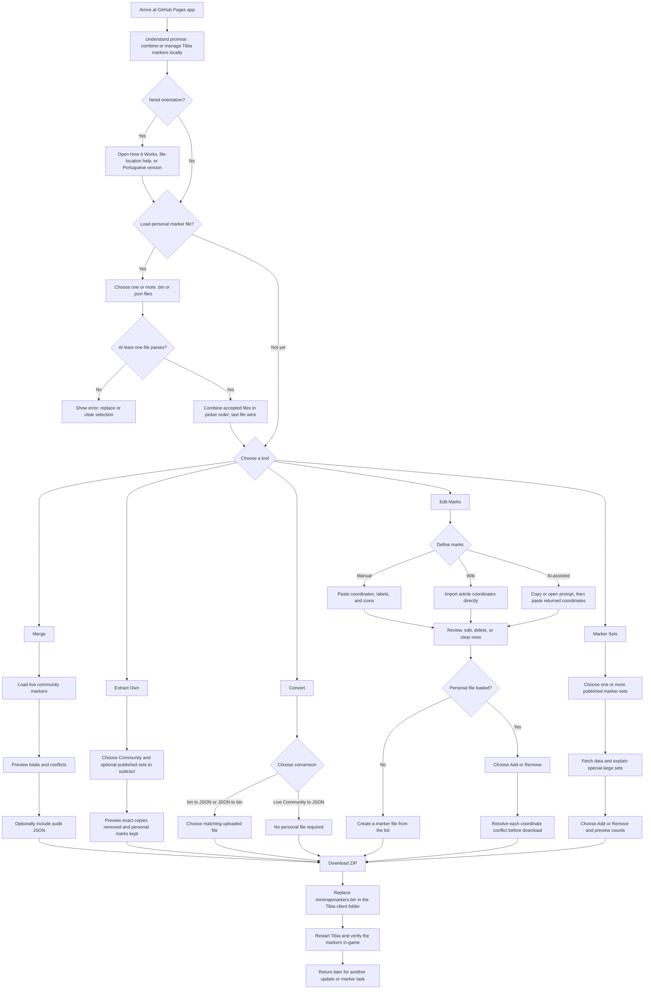
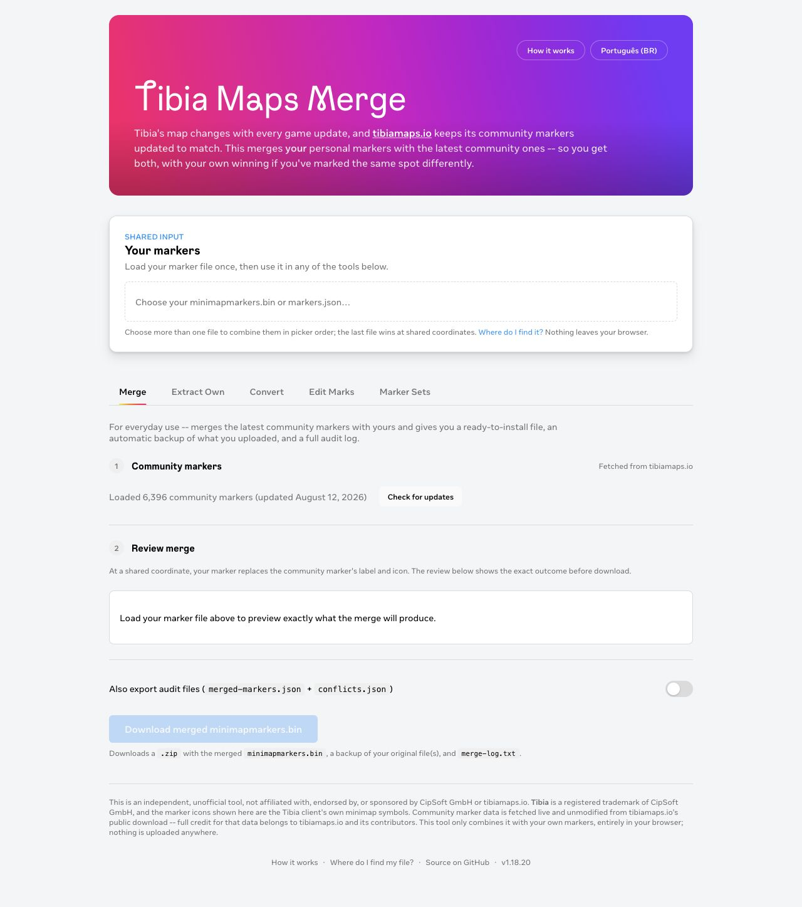
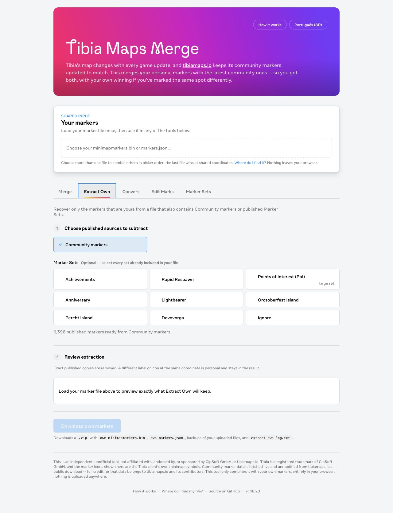
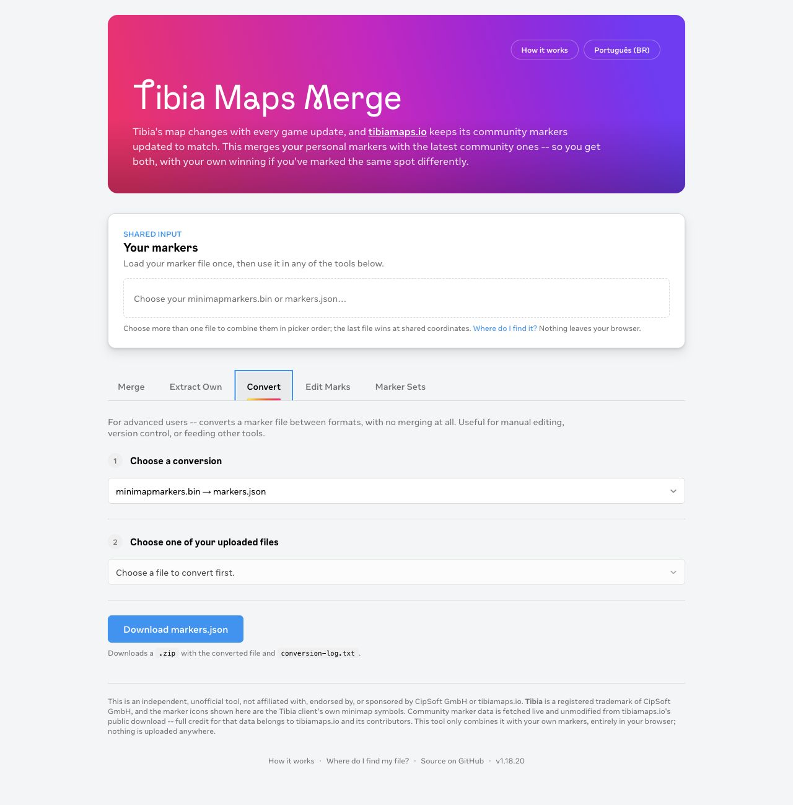
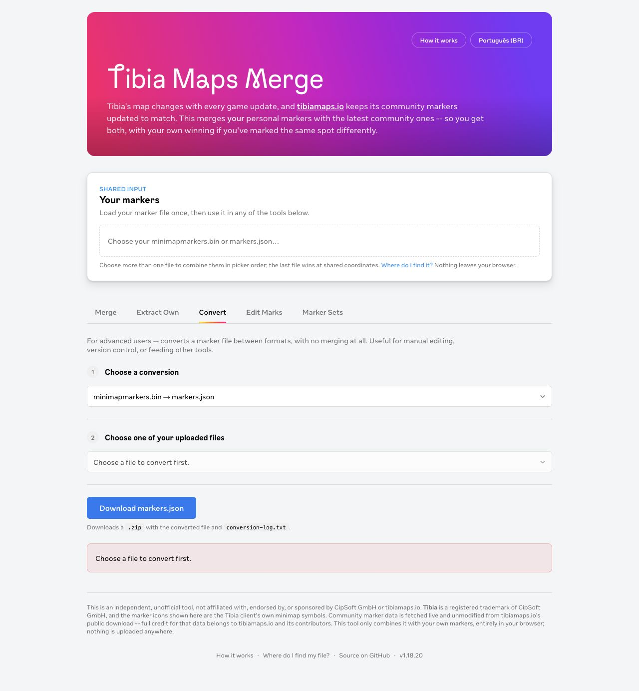
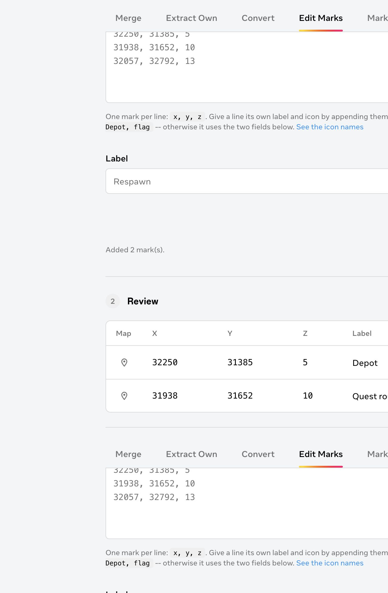
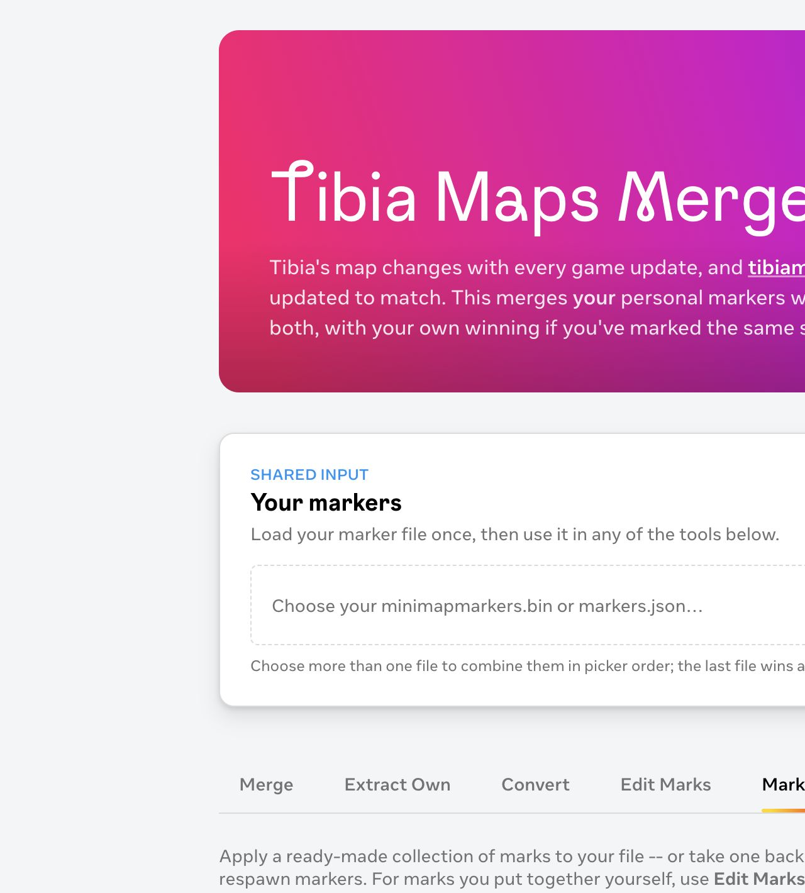
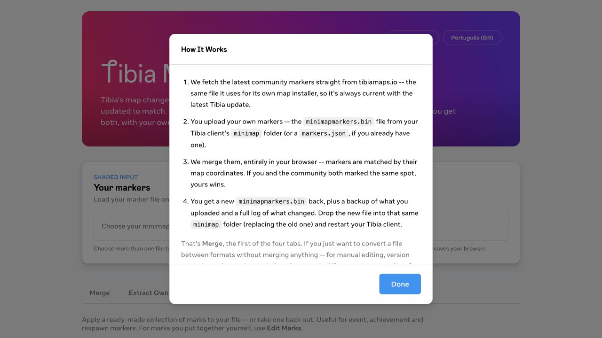

# Tibia Maps Merge: end-to-end UX workflow

Current-state map for the English GitHub Pages app, version 1.18.20, captured on August 16, 2026. The Portuguese entry point mirrors the same structure and behavior.

## Product model

The app is one browser workspace with a shared marker-file input and five task modes. A user can deep-link directly to a mode through the URL hash, switch language, or open contextual help. Most modes require a personal marker file; Edit Marks can create a new file without one, and Convert can export the live community markers without one.

## Numbered journey and health

| Step | What the user does | General health |
|---|---|---|
| 1 | Arrives, reads the promise, optionally changes language or opens help. | Mostly healthy. The value proposition and local-processing reassurance are prominent, but the help sheet says there are four tabs when there are five and does not describe Extract Own. |
| 2 | Optionally loads one or more personal `.bin` or `.json` files into the shared input. | Healthy. One upload feeds every tool, partial parse failures are reported, file priority is explained, and Clear returns focus to the picker. The position may still imply a file is mandatory for every task. |
| 3 | Chooses a mode from the sticky tab list or arrives through a hash link. | Healthy. The tablist has correct roles, roving keyboard focus, Arrow/Home/End behavior, and stable deep links. |
| 4 | Uses Merge for the everyday update path. | Healthy. Community freshness, precedence, outcome counts, optional audit data, backup, and log are all visible before or after download. |
| 5 | Uses Extract Own to recover personal markers from mixed files. | Mostly healthy. The subtraction model and personal-override rule are explicit, but the task is conceptually dense and depends on users remembering every published set already present in the file. |
| 6 | Uses Convert to change formats or export live Community data. | Needs attention. The file-based Download button looks enabled before a source exists; the missing prerequisite is only explained after the user clicks it. |
| 7 | Uses Edit Marks to import or define, review, reconcile, and apply a custom list. | Mixed but strong. It supports manual, wiki, and assistant-assisted entry; preserves drafts; reports bad lines; and makes conflict decisions explicit. It is also the longest and most cognitively demanding branch, and Step 3 stays invisible until a personal file is loaded. |
| 8 | Uses Marker Sets to add or remove published collections. | Mostly healthy. Cards show provenance and freshness, load only selected data, explain the unusually large PoI set, and preview overlap. Without a personal file, selection can succeed but the apply step remains hidden and the CTA remains disabled. |
| 9 | Downloads a ZIP and installs the resulting file in Tibia. | Functional with an external handoff. Backups, logs, and outcome summaries build trust, but the app cannot confirm that the user replaced the right file or restarted the client. |
| 10 | Returns for another update or task. | Mixed. The selected mode and pending Edit Marks list survive a reload, while the personal upload, result messages, and selected marker sets do not. The user must reselect their file on every new browser session. |

## Shared entry and state model

### Entry points

- `/` opens Merge.
- `#merge`, `#extract-own`, `#convert`, `#edit-marks`, and `#marker-sets` deep-link to a mode and survive reload.
- `/pt-br/` provides the same workflows in Brazilian Portuguese.
- How It Works, file-location help, icon names, assistant choices, mark editing, and destructive confirmation open as modal sheets rather than routes.

### Shared file state

1. The user chooses one or more `minimapmarkers.bin` or `markers.json` files.
2. Each file is parsed independently.
3. If some files fail, valid files remain usable and skipped files are reported.
4. Valid groups are combined in picker order; the last file wins at a shared coordinate.
5. The resulting marker set updates Merge, Extract Own, Convert, Edit Marks, and Marker Sets at once.
6. Clear removes the shared file, clears result messages, hides file-dependent steps, and returns focus to the picker.

### Persistence

| State | Persists across reload? | Notes |
|---|---|---|
| Active mode | Yes | Stored in the URL hash with `replaceState`. |
| Edit Marks pending list | Yes | Stored best-effort in `localStorage`. |
| Community download | Temporarily | Cached locally to avoid repeatedly downloading the large archive. |
| Marker-set freshness dates | Temporarily | Cached to limit unauthenticated GitHub API use. |
| Uploaded personal files | No | Browser security requires the user to choose them again. |
| Selected marker sets | No | Selection is in-memory only. |
| Preview and success/error results | No | Recomputed after inputs are restored or chosen again. |

## Branch maps

### Merge

1. The app fetches the current Community archive automatically.
2. Loaded state shows marker count, update date, and Check for updates; failure shows Retry.
3. After a personal file loads, Review merge shows Community, personal, added, identical, overridden/conflict, and final totals.
4. The user can include `merged-markers.json` and `conflicts.json` through the audit switch.
5. Download produces the merged binary, uploaded-file backups, `merge-log.txt`, and optional audit JSON.

### Extract Own

1. Community is selected by default.
2. The user optionally selects every published Marker Set believed to exist in the uploaded file.
3. References load; failures expose retry states.
4. The preview separates exact published copies removed, personal overrides kept, unique personal marks, and final own total.
5. Download produces `own-minimapmarkers.bin`, `own-markers.json`, backups, and `extract-own-log.txt`.

### Convert

1. The user chooses binary to JSON, JSON to binary, or live Community to JSON.
2. File-based conversions require a matching uploaded file; Community export hides the file-selection step.
3. The app converts, round-trip validates where applicable, and downloads the output with `conversion-log.txt`.
4. If no required source exists, the current UI waits until the enabled Download button is clicked before showing an inline error.

### Edit Marks

1. The user defines marks manually, imports a supported Tibia Wiki article, or sends a generated prompt to an assistant and pastes the answer.
2. Coordinates are parsed in batches. Valid lines become rows; invalid lines remain for correction and are listed with errors.
3. The review table supports map lookup, edit, delete, and Remove All with confirmation.
4. Without a personal file, Download creates a new marker file containing the reviewed list.
5. With a personal file, Step 3 appears and offers Add or Remove.
6. Add keeps identical overlaps, exposes each real conflict, and blocks download until every conflict is resolved with Keep Existing Mark or Use New Mark.
7. Remove is coordinate-only and removes matching coordinates regardless of label or icon.
8. Download produces the new binary, any uploaded-file backups, and `edit-marks-log.txt`.

### Marker Sets

1. The user selects one or more of the nine published collections.
2. Update dates load when the mode first opens; marker data loads only after selection.
3. Special context appears for Points of Interest, whose very large list is meant for temporary searching.
4. With a personal file and loaded sets, Step 2 appears with Add or Remove and an exact preview, including duplicate coordinates across sets.
5. Download produces the updated binary, uploaded-file backup, and `marker-sets-log.txt`.

## Recovery and edge paths

| Trigger | Current recovery |
|---|---|
| Community request fails | Inline error and Retry; Merge and Community-dependent extraction stay blocked. |
| Some uploaded files fail to parse | Continue with valid files and list skipped files. |
| Every uploaded file fails | Show a shared-input error and keep dependent actions blocked. |
| File-based Convert has no matching source | Show an inline error after Download is clicked. |
| Wiki URL is invalid, missing, unreachable, or has no coordinates | Show a specific inline message; keep the user on Define marks. |
| Some coordinate lines are invalid | Add valid lines, preserve invalid lines, and list line-specific errors. |
| Edit Marks has unresolved coordinate conflicts | Keep Download disabled until all decisions are made. |
| Marker-set fetch fails | Keep the selection and show an error; changing the selection retries, but the recovery action is not explicit in this mode. |
| Extraction reference fetch fails | Show an explicit Retry action and keep Download blocked. |
| Serialization or round-trip validation fails | Show the error inline and do not download an untrusted result. |

## UX and accessibility findings

### Confirmed strengths

- The single shared upload removes repeated file selection while moving between tools.
- Every destructive or conflict-sensitive operation is previewed before download.
- Backups and human-readable logs make the irreversible external install step safer.
- The tablist, tab panels, native dialogs, labels, focus treatment, and major live status regions provide a solid semantic base.
- Error handling is usually local, specific, and recoverable without losing the whole task.
- The five modes use consistent numbered steps and output-naming primary actions.

### Highest-impact risks

1. **Help is out of date.** How It Works says “the first of the four tabs,” although five exist, and it omits Extract Own. This weakens orientation at the exact point a new user asks for help.
2. **Convert advertises an action that cannot succeed.** For file-based conversions, Download is enabled while the source selector is disabled and empty. Disable the action or direct focus to the shared picker until a compatible file exists.
3. **File requirement is not expressed per mode.** The global upload sits before all tabs, yet two branches can work without it and three cannot. A compact requirement/status line inside each mode would clarify why a step or CTA is hidden or disabled.
4. **Marker Sets retry is implicit.** A failed set remains selected, but recovery depends on changing the selection. Add an explicit Retry action, matching Merge and Extract Own.
5. **The installation handoff is a blind spot.** The app gives instructions but cannot verify success. A post-download checklist could make replacement, backup location, restart, and in-game verification harder to miss.
6. **Dynamic results are inconsistently announced.** Shared upload, Community, merge preview, and extraction source status use live regions, while several post-action errors and success results do not. Keyboard and screen-reader testing should confirm whether focus or announcements make those changes discoverable.

### Recommended sequence

1. Correct the How It Works inventory and add Extract Own.
2. Gate file-based Convert on a compatible source and explain the prerequisite before the CTA.
3. Add a consistent per-mode prerequisite/status line for shared-file-dependent branches.
4. Give Marker Sets an explicit Retry action.
5. Standardize result announcements and run keyboard, screen-reader, contrast, zoom, and mobile reflow checks.
6. Add a compact post-download installation checklist with a clear “return to tool” loop.

## Evidence and limits

The live English app was inspected at a 1280 × 720 desktop viewport. Screenshots were captured during this run and are stored in `guides/images/ux-workflow/`. The repository implementation and tests were used to map post-upload branches, persistence, conflict resolution, output contents, and error handling.

No personal marker file was uploaded to the public site, no output was installed in the Tibia client, and no assistive technology session was run. Post-upload states are therefore implementation-backed rather than screenshot-confirmed; accessibility notes identify likely risks, not WCAG conformance. Mobile reflow, browser download permission behavior, external wiki/assistant handoffs, and the in-game result remain verification gaps.

